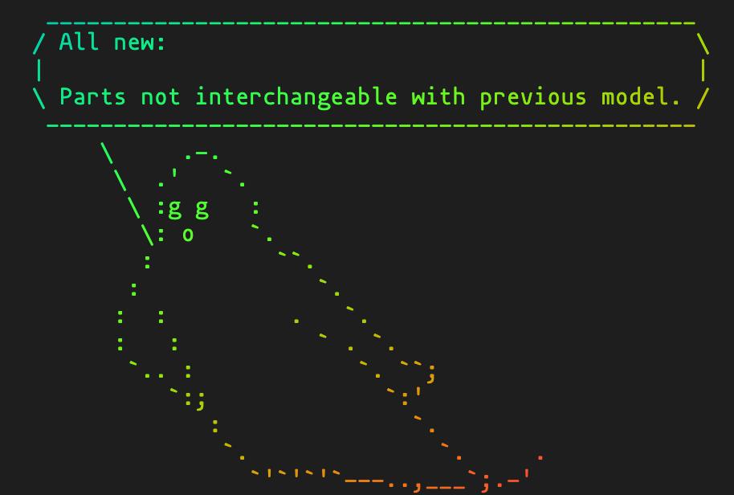

# KAMADHENU

An udderly absurd soothsayer for your shell.



## Installation

``` sh
curl -fsSL https://raw.githubusercontent.com/krry/Kamadhenu/master/bootstrap.sh | $SHELL
```

Then follow the bouncing bytes...

## Usage

Fresh out of the box,\
you get a bare minimum of\
**`275,254,848` squirts of insight**\
delivered one. at. a. time.

All you have to do is ask:

``` sh
kamadhenu
```

Who dares put words in the mouth of Kamadhenu?

``` sh
Kamadhenu Do you love me?
```

``` sh
Kamadhenu Could you learn to love me?
```

Kamadhenu can't help you, but you can still ask.
``` sh
Kamadhenu help
```

### Oh, dear, is it Terminal?
Start each shell sesh fresh with Kamadhenu.

``` sh
echo Kamadhenu >> .$(basename $SHELL)rc
```

#### Coming soon
Pipe `stdout` to Kamadhenu (like a cat)

``` sh
# You ever drunk Bailey's out of a shoe? | Kamadhenu
```

## Dependencies

- [fortune](https://github.com/bmc/fortunes/)
- [cowsay](https://linux.die.net/man/1/cowsay)
- [lolcat](https://github.com/busyloop/lolcat)
- [figlet](http://www.figlet.org/)
- and `coreutils`, specifically for GNU `shuf` which Macs don't come with.

## Troubleshooting

If you encounter a hiccup, hold your breath. Anything else, check here.

#### No Homebrew, dog? That's otay.

The dependencies are listed in the `Brewfile` and right nearby.
If you gather those, you're most of the way there.
All that's left is to copy those artisanally curated, hand-fingered
cows, fonts, and fortunes into their respective homes on your machine.

#### Flubbed with the dismount? Failed to symlink?

The likely culprits are file permissions. Make sure you launch the
bootstrap script from the safety of a locally owned, openly permissioned dir.

If nothing happens when you fire `Kamadhenu` into the command line,
the symlink probably didn't make it into your `PATH`. Nobody knows
your `PATH` like you do, so give it an `echo $PATH` and find your way.

#### Missing cows and/or figlets? Fortunes failing?

These need to be where `cowsay`, `figlet`, and `fortune` would look for them.
Once again, you have a keen advantage in determining this.

On my crusty ol' MacBook, they sticks 'em thusly:
* cows go in: `/usr/local/share/cows`
* figlets in: `/usr/local/share/figlet/fonts`
* fortunes => `/usr/local/share/games/fortunes`

If you especially enjoy Kamadhenu, fork away, or come and play!
I began this project because I didn't know jack about shell scripting.

Now that it's alive, it'd be fun to glitter the flock out of it.
Who doesn't need yet another MOTD, amirite?

## TODO (maybe)

- [ ] getopts for:
  - cow face settings
  - choose default cow
  - choose default font
  - monochrome mode - no lolcat
  - no cowsay mode
  - no fortune mode
  - supersize mode
- [ ] moar easter eggs and batty interwoven CLI tomfoolery
- colorschemes!
- a Linux bootstrap script


